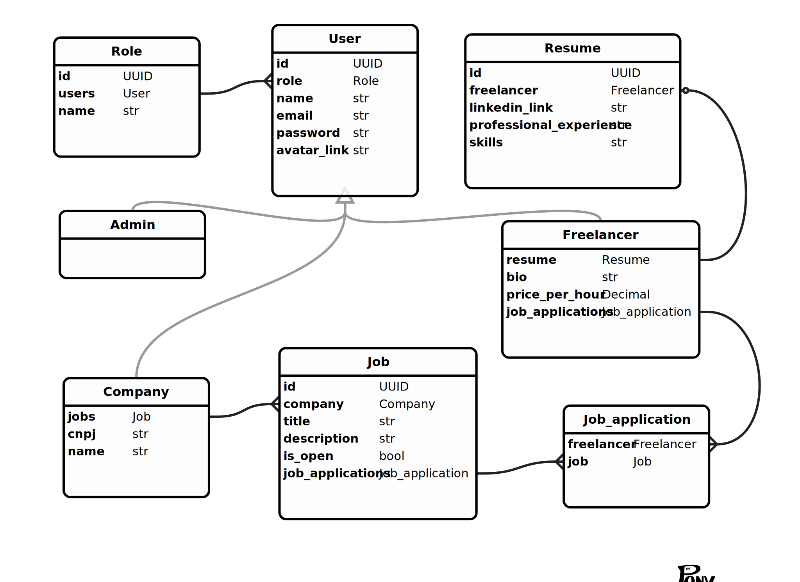
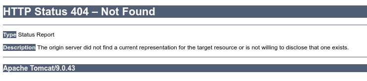

<div align="center">
    <h1>TrampoZ - Spring</h1>
    
</div>

<p align="center">
  

  

  

  
</p>

Índice:

- [🤔 O que é](#-o-que-é)
  - [Diagrama Entidade-Relacionamento](#diagrama-entidade-relacionamento)
- [🎯 Objetivos e entregas](#-objetivos-e-entregas)
- [⚙ Preparando o ambiente](#-preparando-o-ambiente)
  - [Utilizando Windows 10?](#utilizando-windows-10)
  - [Java](#java)
  - [Maven](#maven)
  - [Docker e Docker Compose](#docker-e-docker-compose)
- [🚀 Executando a aplicação](#-executando-a-aplicação)
- [📝 Licença e créditos](#-licença-e-créditos)

## 🤔 O que é

TrampoZ é um plataforma ficticia para anúncio de trabalhos freelance.

### Diagrama Entidade-Relacionamento



## 🎯 Objetivos e entregas

0. (Branch: template) Criar um template básico funcional.
1. (Branch: jpa) Aplicação Spring Boot com acesso a dados usando Spring Data JPA. A aplicação deve possuir:
   - Entidades associadas (OneToMany/ManyToOne ou ManyToMany);
     - Entidades iguais ou similares às apresentadas nos exemplos não serão aceitas;
     - Entidades associadas às entidades apresentadas nos exemplos não contam;
   - Consultas que envolvam mais de uma entidade (Join);
   - Consultas com mais de um parâmetro;
   - Uso correto de transações. Lembre-se: uma transação é composta por duas ou mais operações que alteram o estado do Banco de Dados!
2. (Branch: rest) Aplicação do item 1 com serviços REST. A aplicação deve seguir o padrão MVC e possuir:
   - Rotas com diferentes métodos de acesso (GET, POST, DELETE e PUT);
   - Tratamento de CORS;
   - Formatação de JSON
   usando JsonView.
3. (Branch: main) Aplicação do item 2 com segurança. A aplicação deve possuir:
   - Autenticação usando login e token JWT;
   - Autorização por anotações (não anotar Controllers).
   - Utilizar, no mínimo, dois níveis de autorização (Usuário e Administrador).
4. (outro repositório) Aplicação front-end SPA JavaScript que consuma os serviços do back-end construído nos itens 1, 2 e 3. A aplicação deve possuir:
   - Múltiplas rotas;
   - Tratamento de erros de requisição;
   - Gerenciamento de estado (Redux, Vuex, etc);
   - Elementos visuais diferentes de acordo com o nível de autorização do usuário.

## ⚙ Preparando o ambiente

### Utilizando Windows 10?

Recomendamos configurar o [WSL 2](https://docs.microsoft.com/en-us/windows/wsl/about) no seu Windows 10, assim você consegue trabalhar como se estivesse usando uma distribuição Linux!

Confira esse mini curso gratuito no youtube:

[](https://youtube.com/playlist?list=PLlAbYrWSYTiOpefWtd6uvwgKT1R-94Zfd)

Ou se preferir, instale o [gerenciador de pacotes Chocolatey](https://chocolatey.org/) e o [terminal CMDER](https://cmder.net/).

### Java

Recomendamos utilizar o SDKMan em vez de instalar o Java diretamente:

<https://sdkman.io/install>

Tendo tudo instalado, basta rodar:

```bash
sdk install java 11.0.10.hs-adpt
```

### Maven

De forma semelhante ao Java:

```bash
sdk install maven 3.6.3
```

### Docker e Docker Compose

Nós utilizamos contêineres Docker para levantar o banco de dados Postgres e a aplicação visual Adminer. Certifique-se de instalá-lo em: <https://docs.docker.com/get-docker/>.

Também é necessário instalar o Docker Compose: <https://docs.docker.com/compose/install/>

## 🚀 Executando a aplicação

Inicializa os contêineres:

```bash
docker-compose up -d
```

Instale as dependências:

```bash
mvn clean install
```

Suba o servidor:

```bash
mvn spring-boot:run
```

Para se certificar de que tudo está funcionando, abra seu navegador no endereço `http://localhost:8080/`.

Esse deve ser o resultado:



## 📝 Licença e créditos

Esse projeto foi desenvolvido sob a [licença APACHE 2.0](https://opensource.org/licenses/Apache-2.0).

Diagrama Entidade-Relacionamento desenolvido com a ferramenta online [Pony ORM Editor](https://editor.ponyorm.com/).

Icon made by <a href="http://www.freepik.com/" title="Freepik">Freepik</a>
from <a href="https://www.flaticon.com/" title="Flaticon"> www.flaticon.com</a>
